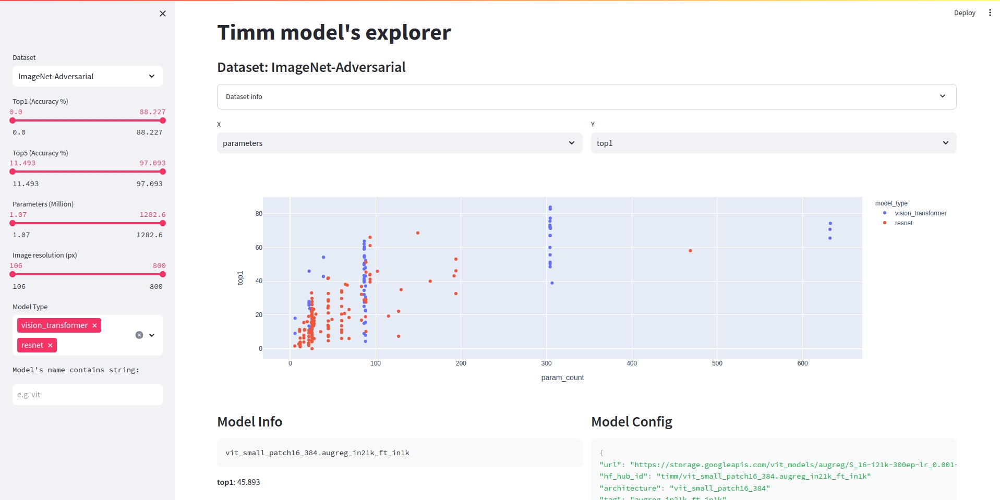

# Timm model's explorer

[**timm**](https://github.com/huggingface/pytorch-image-models) stands out as a wonderful Python library for Computer Vision models, boasting an extensive collection of over 500 model architectures pre-trained on Imagenet. For those delving into the world of computer vision, timm proves to be an indispensable resource.

This Streamlit application serves as a user-friendly interface for navigating the myriad models available within the timm library.

Try it here: [https://timm-model-explorer.streamlit.app/](https://timm-model-explorer.streamlit.app/)

# TODO List

- [ ] Incorporate missed inference and training stats
- [ ] Include model's name tag descriptions
- [ ] Optimize for responsive website
- [ ] Include links to model papers
- [ ] Include architecture visualization (e.g. netron)
- [ ] Include other metrics like (e.g. weight sensitivity, )
- [ ] Incluse some inference example (e.g. gradcam)
