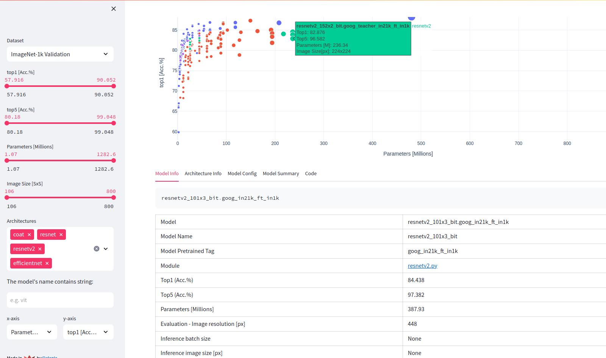

# Timm model's explorer

[**timm**](https://github.com/huggingface/pytorch-image-models) is a very popular python library for Computer Vision models, with an extensive collection of over 1000 model architectures, pre-trained on Imagenet.

This Streamlit application serves as a user-friendly interface for navigating the myriad models available within the timm library.

Try it here: [https://timm-model-explorer.streamlit.app/](https://timm-model-explorer.streamlit.app/)

# What you can do
This is a first app prototype and can be useful to visualize and search the following stuff:

- Plot model's statistics like:
    - Top1, Top5 accuracy on Imagenet dataset
    - 8 provided datasets based on Imagenet, to better evaluate robustness and *out of domain* performances
    - Number of parameters
    - Inference and training performances of the models
- Get for a selected model the following informations:
    - model's configuration
    - Model Summary, generated by [torchinfo](https://github.com/tyleryep/torchinfo)
    - Basic code to load the model

# TODO List

- [ ] Keep scatter plot zoom
- [ ] Incorporate missed inference and training stats
- [ ] Include model's name tag descriptions
- [ ] Optimize for responsive website
- [x] Include links to model papers
- [ ] Include architecture visualization (e.g. netron)
- [ ] Include other metrics
- [ ] Incluse some inference example (e.g. gradcam)
